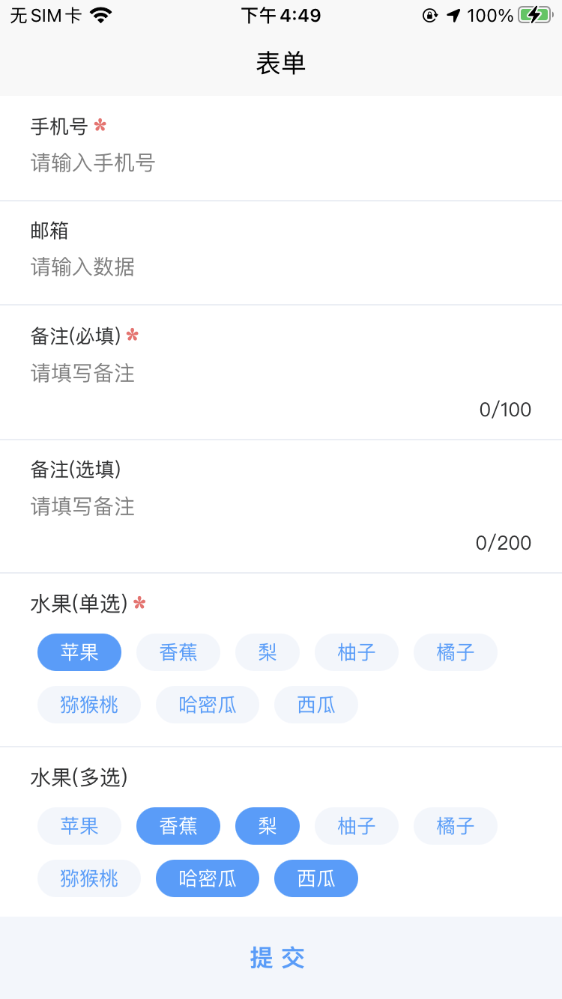

#### 项目说明

整理自己封装使用过的一些组件

#### 项目搭建

1. 配置组件自动注册
在```pages.json```文件下添加下面代码
```
"easycom": {
	"autoscan": true,
	"custom": {
		"m-(.*)": "@/components/my/m-$1/index.vue" ,// 匹配components目录内的vue文件
		"p-(.*)": "@/components/plug/p-$1/index.vue" 
	}
},
```

2. 项目目录说明

```components```: 公用组件目录
  ```my```: 自己封装的目录
  ```plug```: 使用别人封装的目录（插件）
```css```: 公用css目录
```libs```: 公共js方法
```pages```: 项目目录
```static```: 静态资源目录（图片，图标等）
```store```: vuex目录

3. 使用阿里图标库图标

* 在阿里图标库中新建项目，如图所示


* 复制生成的 ```Font class``` 样式到 ```css-icon.css``` 文件

* 在项目 ```App.vue``` 中引用 ```icon.css``` 文件全局使用

```
@import url("./css/icon.css");

```

4. 公共js方法挂载到全局使用

* 在 ```libs``` 目录新建 ```index.js``` 文件，配置 ```js``` 文件引用

* 在 ```main.js``` 文件中引用到全局

```
//混入，全局方法
import {
	mixin,
	$u
} from '@/libs/index.js'

Vue.mixin(mixin)

Vue.prototype.$u = $u
```

5. 通用正则

* 邮箱 ^[a-zA-Z0-9_-]+@([a-zA-Z0-9]+\.)+(com|cn|net|org)$
* 手机号 ^1[0-9]{10,10}$

6. 展示图




